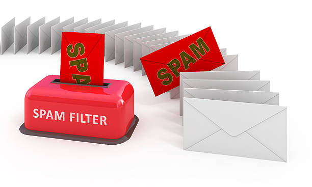

# Spam SMS Detection App

## Overview
Welcome to the Spam SMS Detection App! This app is designed to predict whether an SMS message is spam or legitimate based on its content using machine learning.

## Repository Structure
- **spam_classifier.pkl**: This file contains the saved spam classifier model.
- **requirements.txt**: This file lists all the dependencies required to run the app.
- **streamlit_app.py**: This is the main script that runs the Streamlit app.
- **assets/**: This folder contains images and other static files used in the README or the app.

## Using the App
You can use the app to predict spam SMS by either entering a single message, uploading a CSV file with multiple messages, or fetching emails directly from your Gmail account. The app will then use the trained model to make predictions. Here’s how you can use it:

### Single Message Prediction
1. Enter the message content in the text area provided.
2. Click the 'Predict Single Message' button to get the prediction.

### Batch Prediction
1. Upload a CSV file containing a column named 'message' with the messages you want to classify.
2. The app will display the predictions and provide an option to download the results as a CSV file.

### Email Integration
1. Authenticate using your Google account.
2. Click 'Fetch Emails' to retrieve the latest 10 emails from your inbox.
3. The app will display the emails, and you can classify them for spam.

You can access the app using this link: [Spam SMS Detection App](https://).

## How the Model Works
The model uses a Multinomial Naive Bayes classifier with TF-IDF vectorization to classify SMS messages. The TF-IDF vectorizer converts the text data into numerical form, and the Naive Bayes classifier makes predictions based on this data.

## Business Applications
Businesses can use this app to:
- Automatically filter spam messages from legitimate ones.
- Protect users from potential phishing and scam messages.
- Improve customer satisfaction by reducing spam.

## Feedback
We encourage you to try out the app and provide feedback. Let us know if you find it useful for your business and if there are any improvements you'd like to see.

## CODSOFT Project Repository
If you want to see the CODSOFT repository where the notebook used for this project is stored, you can visit my GitHub repository [here](https://).

## Contact
Feel free to reach out if you have any questions or suggestions. Your feedback is highly appreciated!
